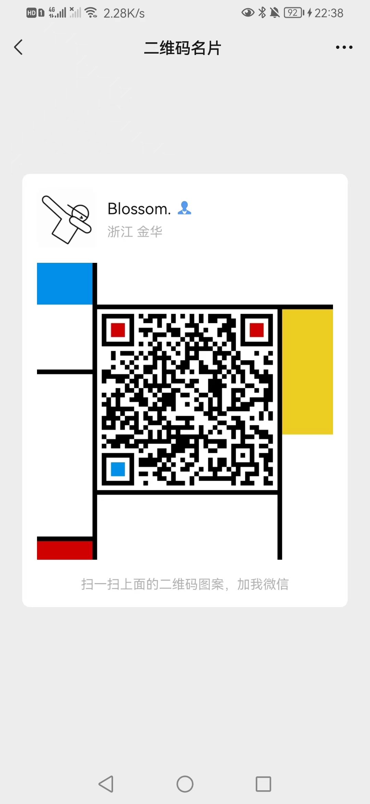

# 暨大课程速通
本项目系作者在暨大读本科期间所做的课程作业的参考答案集合，同时会上传一些作者自制的课程前置知识整理，帮助各位更好的学习专业课

# 本项目的课程

- 高级语言程序设计/实验
- Python程序设计/实验
- C++程序设计/实验
- Java程序设计/实验
- 数字电子技术基础课后作业/实验

### 更详细的高级语言程序实验and期末考试解答请移步知乎（点击下方链接）

[大一下C语言合订本](https://zhuanlan.zhihu.com/p/525415502)

[大一下C语言机试](https://zhuanlan.zhihu.com/p/530389425)

## 具体详细情况请咨询：
vx：poex17369727073
qq：361265483

